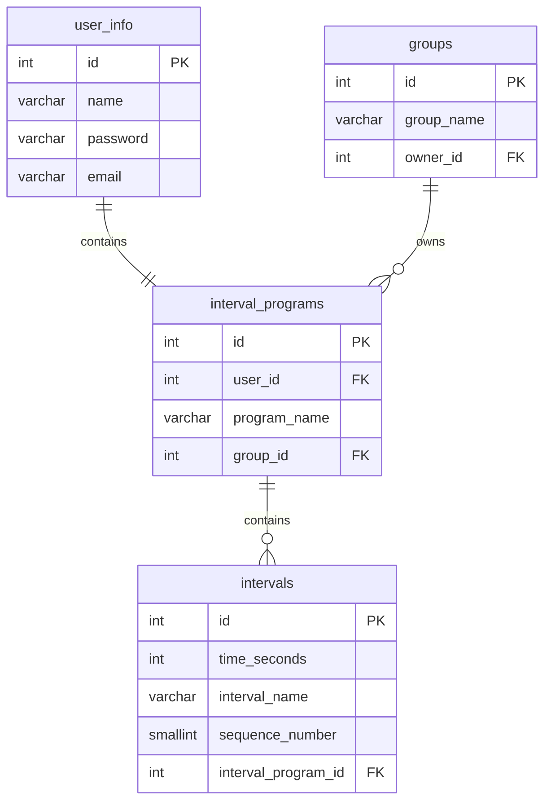

## [an interval timer app](https://timer.chrisjohnedis.com)

this app is striving to provide a solution to the situation where a user has a series of predefined tasks that the user plans to do where time is a concern. if the user is a restaurant owner seeks to create a base timeline for how long daily prep should take, the user would program a series of intervals with this app. for example, picking basil might take 10 minutes, grating cheese 15 minutes, and dough 20 minutes. the app will inform the user the next task and start counting down as soon as the user taps to advance the screen.

at the conclusion of the sequence, data is stored about how long over or under time each task was for further analysis. users can use the app both as an individual or as a member of team. these roles are similar to user/admin roles.

### technologies

- vanilla typescript single page app
- served by nodejs http server
- run manually on an AWS EC2 instance
- an nginx server on the instance handles the ssl certficates and binds requests to the appropriate ports
- postgreSQL
- future plans involve finishing a testing and building pipeline with github actions and codedeploy

### database

### screens

Tap 0.0 is the screen before start. The name of the interval sequence is displayed (I accidentally gave the full sequence the same name as the first interval, which is confusing).

---

Tap 1.0 is the result of the first tap: the name of the Interval 1 is displayed at the top, and a countdown of the previously specified duration begins.

---

Tap 1.1 illustrates the automatic transition to counting up in red numerals if the Interval 1 countdown reaches 0:00 before Tap 2. Countup in red continues ad infinitum until Tap 2.

---

<!---
---

Tap 2.0 illustrates the PLUS/MINUS option deselected: finishing the preceding interval over/under time does not add or subtract time from the following interval.

---

Tap 3.0 illustrates the initiation of an early tap to end Interval 2.

---

Tap 3.1 shows the result of that early tap with the PLUS/MINUS option selected: the balance of the time from Interval 2 has been added to the normally-allotted time for Interval 3, which immediately starts counting down as it would under normal conditions; the addition of time is indicated by a change to blue digits.

---

Tap 3.2 illustrates a change back to black digits once the added time from the previous interval has elapsed.

---

Tap 4.0 illustrates the initiation of a late tap to end Interval 3; the clock has started counting up from 0:00. Red digits indicate overtime.

---

Tap 4.1 shows the result of the late tap: the overage from Interval 3 has been subtracted from the time normally allotted for Interval 4. This abbreviated period is indicated by a change to yellow digits; they will remain yellow for the duration of Interval 4 (switching to red if Interval 4 runs long, of course).

I think this covers all the options I mentioned, at least as far as the bulk of the UI is concerned. Obviously it needs some kind of menu for editing interval names / durations / colors and toggling the plus/minus option.

### logic

CUSTOMIZABLE OPTIONS:
Number of intervals
Duration of each interval
Name of each interval
Color of each interval

MAIN SCREEN BEFORE START: Display sequence name, full screen, neutral background

MAIN SCREEN AFTER START:  Display interval name, top ¼ of screen, display countdown clock, bottom ¾ of screen; background color=custom interval color

Single screen tap to start sequence (whole screen is a button).

Once sequence begins, only two user inputs are accepted. Single tap = start next interval in sequence, four taps = stop and reset entire sequence.

At screen tap 1:
First interval starts:
Big digital clock counts down from the specified duration (minute:second)
Background color corresponds to current interval
At elapsed time:
Three-second alarm sounds
Digits change color (e.g. from black to red)
Clock begins counting up
At screen tap 2:
Next interval starts, etc…

IF screen is tapped early
THEN next interval begins
AND remaining time from short interval is recorded
(which interval? amount under time? time and date?)

IF screen is tapped late
THEN next interval begins
AND overtime from long interval is recorded
	(which interval? amount over time? time and date?)

OPTION (can be toggled on or off):
overtime/undertime is automatically subtracted/added to next interval
digits change color to indicate extended or abbreviated duration
IF PREVIOUS UNDERAGE:
digits white until time added to subsequent interval has elapsed
IF PREVIOUS OVERAGE:
digits red for entire duration of subsequent abbreviated interval

Custom sequences of intervals can be named and stored (e.g. “Opening Shift,” “Monday Workout,” etc.)

FANCY EXTRAS: haptic feedback/sound at screen tap; good typeface; good alarm sound(s); display interval number in front of interval name (toggle on/off); only display hours/minutes when interval duration is long enough to make them relevant

OTHER POSSIBLE USER INPUTS:
Double screen tap: Restarts interval
Triple screen tap: Restarts entire sequence of intervals
BUT…
Probability of user error high
This functionality not useful for me, although it would likely broaden utility / marketability

--->

### license

- some information: [no_vibing_please](chrisjohnedis.com)
- feel free to ask [questions](christopher.johnedis@gmail.com)

MIT License

Copyright (c) [2023] [christopher johnedis]

Permission is hereby granted, free of charge, to any person obtaining a copy
of this software and associated documentation files (the "Software"), to deal
in the Software without restriction, including without limitation the rights
to use, copy, modify, merge, publish, distribute, sublicense, and/or sell
copies of the Software, and to permit persons to whom the Software is
furnished to do so, subject to the following conditions:

The above copyright notice and this permission notice shall be included in all
copies or substantial portions of the Software.

THE SOFTWARE IS PROVIDED "AS IS", WITHOUT WARRANTY OF ANY KIND, EXPRESS OR
IMPLIED, INCLUDING BUT NOT LIMITED TO THE WARRANTIES OF MERCHANTABILITY,
FITNESS FOR A PARTICULAR PURPOSE AND NONINFRINGEMENT. IN NO EVENT SHALL THE
AUTHORS OR COPYRIGHT HOLDERS BE LIABLE FOR ANY CLAIM, DAMAGES OR OTHER
LIABILITY, WHETHER IN AN ACTION OF CONTRACT, TORT OR OTHERWISE, ARISING FROM,
OUT OF OR IN CONNECTION WITH THE SOFTWARE OR THE USE OR OTHER DEALINGS IN THE
SOFTWARE.
